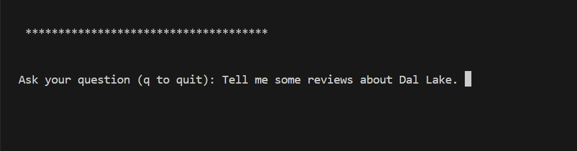
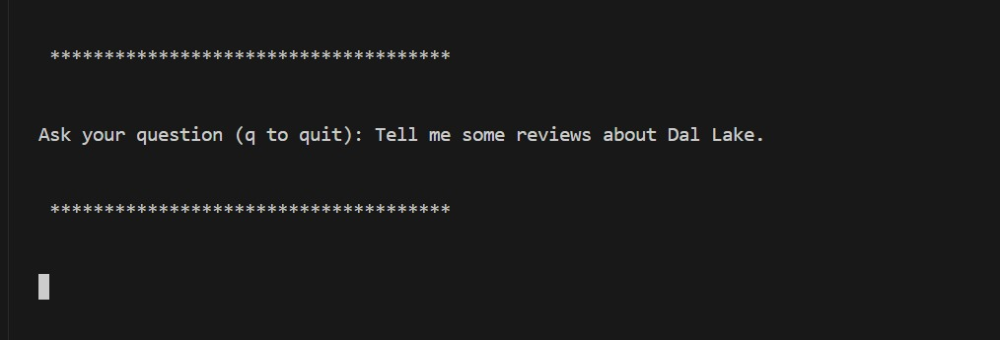
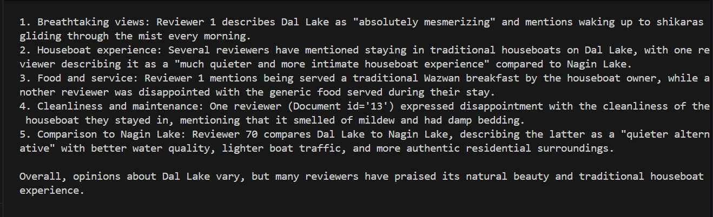
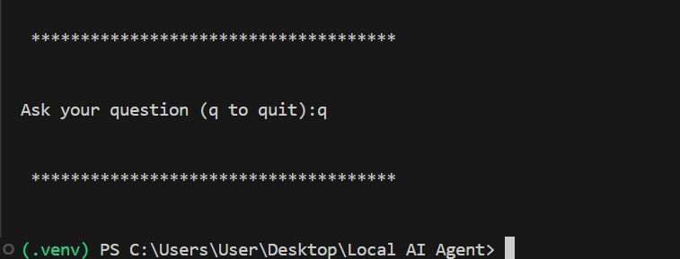

# Local AI RAG Agent: Tourism Review Assistant

A privacy-focused Retrieval-Augmented Generation (RAG) agent that runs entirely locally, allowing you to query tourism reviews for Jammu and Kashmir without an internet connection.

## Project Walkthrough

### 1. Terminal View (Before Querying)

This shows the agent fully initialized and waiting for input. The system is ready to receive your questions about the Kashmir dataset.

### 2. Querying (The Process)

  This state captures the moment the user is actively typing their question. It highlights that the system is ready to process user input.

### 3. Query (Submitted)

This visual shows that the query has been successfully submitted to the system, triggering the retrieval and generation pipeline.

### 4. Response (The Output)

This displays the final output generated by the LLM. It shows the detailed, context-aware information retrieved from the CSV file.

### 5. Quit (Exiting)

   This shows the clean exit state. It confirms that the agent has finished the current session and returned to the main terminal prompt.

## Tech Stack
* **Language:** Python 3.14
* **LLM Engine:** Llama 3.2 (via Ollama)
* **Framework:** LangChain & ChromaDB

## Setup
1. Clone this repository.
2. Activate your virtual environment and install dependencies:
   ```bash
   pip install -r requirements.txt

3. And run the file by typing localagent.py and clicking enter

Last Updated: June 2026

Maintained By: Affan Bhat 

Repository: https://github.com/devAffaan/Local-AI-RAG-Agent_Tourism-Review-Assistant
